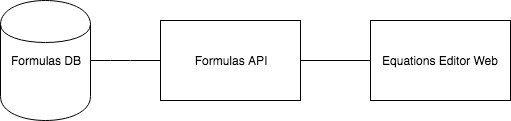
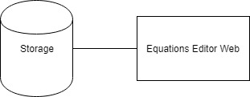

# Architecture overview

This document describes the high level architecture of Equations Editor.

## Three tier architecture

In this initial approach the system consist of two components:

- Equations Editor Web - Vue.js single page application
- Formulas API - simple REST API connected with database containing example mathematical formulas.

## Database as a service

To get rid of the backend service, there is a possibility to use something like Firebase or database hosted on Google Cloud Platform exposed as a REST API.
